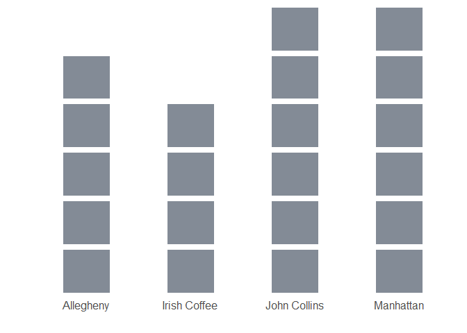

```{r echo=FALSE}
knitr::opts_chunk$set(message = FALSE, warning = FALSE, dev = "svglite")
```


```{r include = FALSE}
library(tidyverse)
library(rlang)
cocktails <- read_csv("https://raw.githubusercontent.com/sccmckenzie/cocktail-ingredients/master/cocktails.csv")

n4_0 <- function(data, var, group) {
  var <- enexpr(var)
  group <- enexpr(group)
  
  stopifnot(is.data.frame(data))
  data <- data
  
  new_function(
    exprs(inventory = , gamma = 5),
    expr({
      choices <- setdiff(unique(pull(data, {{var}})), inventory)
      a <- data %>% 
        filter(!{{var}} %in% inventory) %>% # remove elements chosen in previous iterations
        group_by({{group}}) %>% 
        summarise(y = list({{var}}), .groups = "drop") %>% # nest remaining elements as <chr> for each group (bottleneck)
        tidyr::crossing(c = choices) %>% 
        rowwise() %>% 
        mutate(y = length(y[!y %in% c]), # what is the length of remaining ingredients for each selection?
               y = exp(2 / (1 + gamma * y)) ^ 2) %>% # optimization fn
        ungroup() %>% 
        arrange(c, {{group}}) %>% 
        rename(grp = {{group}})
      
      # below code used to be accomplished with dplyr syntax - significant performance gain using matrices
      with(a, matrix(y, ncol = n_distinct(c), dimnames = list(unique(grp), unique(c)))) %>% 
        colSums() %>% 
        which.max() %>% 
        names()
    }),
    current_env()
  )
}

selection_path <- function(data, var, group, gamma = 5, cutoff = NULL) {
  var <- enexpr(var)
  group <- enexpr(group)
  
  n4 <- n4_0(data, {{var}}, {{group}})
  
  set <- unique(pull(data, {{var}}))
  if (is.null(cutoff)) cutoff <- length(set)
  out <- character(length = cutoff)
  
  for (i in seq_along(out)) {
    message(i)
    
    out[i] <- n4(out, gamma)
  }
  
  out
}

capability2 <- function(x, data, group, var, collapse = TRUE) {
  out <- list()
  
  for (i in seq_along(x)) {
    out[[i]] <- data %>% 
      with_groups({{group}}, filter, all({{var}} %in% x[1:i])) %>% 
      distinct({{group}}) %>% 
      pull()
  }
  
  df <- tibble(i = seq_along(x), x, out)
  
  df1 <- df %>% 
    unnest(cols = out, keep_empty = TRUE) %>% 
    with_groups(i, mutate, performance = n_distinct(out, na.rm = TRUE))
  
  if (!collapse) {
    output <- df1
  } else {
    df1 <- df1 %>%
      with_groups(out, slice_min, i)
    
    output <- df %>%
      filter(!x %in% df1$x) %>%
      select(i, x) %>% 
      bind_rows(df1)
  }
  
  output %>%
    rename({{var}} := x,
           {{group}} := out) %>%
    arrange(i)
}

```


# Introduction

In [Part 1](/cocktails-1/), we used the `stringdist` & `fuzzyjoin` packages to clean the `cocktails` dataset.

With a tidied dataset, we return to the original problem statement:

<div id = "problem-statement">
#### What ingredients should you buy in order to maximize your mixological palette? Assume your shopping cart holds $n$ items.
</div>

Assumptions:

1. We interpret "maximize mixological palette" to strictly mean *achieve as much variety as possible*. In other words, we won't assign weight to the drink based on its popularity.[^1] For this problem, we are trying to maximize the quantity of *substantiated* recipes.

2. For the scope of this post, let's suppose we are interested in whiskey-based cocktails.

```{r}
whiskey <- cocktails %>% 
  with_groups(drink, 
              filter, 
              any(str_detect(ingredient, "(bourbon|whiskey)")))

unique(whiskey$drink)
```

Between these drinks, there are `r n_distinct(whiskey$ingredient)` ingredients.

```{r echo = FALSE}
unique(whiskey$ingredient)
```

It's feasible that we could acquire all of these items before the dinner party - given ample time + assuming we could locate these items at one store. We simplify these contingencies into one parameter, $n$, the number of items our shopping cart can hold.

For the sake of discussion, let's suppose $n = 3$. Where do we start?

Bourbon? Lemons? Sugar? These ingredients have a high occurrence rate in the `whiskey` dataset - therefore, we assume it would be a valuable use of shopping cart space to grab these ingredients.

<p style = "text-align: center"><caption>(#tab:mytbl-1)Most common ingredients in `whiskey` dataset</caption></p>
```{r echo = FALSE}
library(reactable)

htmltools::div(
  style = "width: 400px; margin-left: auto; margin-right: auto",
  whiskey %>% 
  count(ingredient, sort = T, name = "frequency") %>%  
  reactable(fullWidth = FALSE,
            compact = TRUE,
            columns = list(
              ingredient = colDef(width = 200),
              frequency = colDef(width = 200)
            ))
)

```
<br>

Great! Now we can print out Table \@ref(tab:mytbl-1) and take it to the store. It's important to note that regardless of $n$, we always begin our selection from the top of Table \@ref(tab:mytbl-1) and work our way down. 

If $n = 3$, we select bourbon, lemon, and sugar. For $n = 5$, we add blended whiskey and powdered sugar.

```{r echo = FALSE}
by_count <- capability2(count(whiskey, ingredient, sort = TRUE)$ingredient, data = whiskey, group = drink, ingredient)
```

We define subset *performance* as the **number of substantiated recipes for a given $n$**.

Figure \@ref(fig:count-selection-performance) illustrates the overall performance for all values of $n$, adhering to the prescribed order in Table \@ref(tab:mytbl-1).

```{r count-selection-performance, echo = FALSE, fig.cap = "Set selection performance based on occurrence frequency", fig.align="center"}
by_count %>% 
  select(i, performance) %>% 
  fill(performance, .direction = "down") %>% 
  ggplot(aes(i, performance)) +
  geom_line(color = "#1F77B4", size = 2) +
  geom_point(data = by_count %>% filter(performance == 1)) +
  geom_curve(color = "#1F77B4", x = 7, y = 1, xend = 11, yend = 24, angle = 90, curvature = -0.2) +
  geom_label(label = "1st complete recipe @ 7 ingredients", x = 11, y = 24, label.padding = unit(0.5, "lines"), fill = "#1F77B4", color = "white") +
  theme_minimal() +
  labs(x = "n (ingredients)",
       y = "# of substantiated recipes") +
  theme(text = element_text(size = 14))
```
<br>

Utilizing the selection order provided by Table \@ref(tab:mytbl-1), we would actually need to purchase $n = `r by_count %>% filter(performance == 1) %>% pull(i)`$ ingredients to fulfill our first recipe: Kentucky B & B, which is comprised of only two ingredients: (1) bourbon & (2) benedictine.

Something isn't right - why did we need to purchase 7 ingredients to make a Kentucky B & B? This seems like a *waste* of shopping cart space. Frequency-based ingredient order is clearly not the optimal selection scheme for our [problem statement](#problem-statement).

# Rethinking the approach

We need to develop an algorithm that embodies the constraints of this problem more effectively than the frequency-based method above.

For example, it is possible to select 7 ingredients to fulfill recipes for Kentucky B & B (2), Algonquin (3), and Midnight Cowboy (2). The key observation is that the total amount of ingredients between these drinks sums to 7.

There is an underlying logic here - any 2nd grader could outperform the frequency-based method when presented this problem (though I'm certainly not condoning underage drinking). But how do we translate this underlying logic into an algorithm?

For each $n$, we could try selecting the ingredient that results in fulfillment of $1$ or more recipes.
```{r}
shopping_cart <- character() # we start with an empty shopping cart

choices <- unique(whiskey$ingredient)
  
n_recipe_fulfilled <- integer()

# for each choice, how many recipes are fulfilled?
for (j in seq_along(choices)) {
  n_recipe_fulfilled[j] <- whiskey %>% 
    with_groups(drink,
                filter,
                all(ingredient %in% c(choices[j], shopping_cart))) %>% 
    count(drink) %>% 
    nrow()
}

choices[n_recipe_fulfilled > 0]
```
But there are no drinks comprised of only $1$ ingredient! If this routine will not work for $n = 1$, we certainly cannot generalize it for any arbitrary $n$.

We can augment this approach by revisiting the `n_recipe_fulfilled` vector, which currently displays fulfilled recipes for a given ingredient choice. If this vector consists of all zeroes, then our algorithm reaches a dead end.

```{r echo = FALSE}
print(n_recipe_fulfilled, width = 50)
```

Despite the above result consisting of all zeroes, there *has* to be an optimal choice. We need to increase the level of granularity available to the algorithm at each $n$.

Suppose, again, that $n = 1$: we currently have $0$ ingredients, and we need to choose $1$.

```{r echo = FALSE, include = FALSE}
set.seed(8)
whiskey_sample <- whiskey %>% 
  filter(drink %in% sample(unique(drink), size = 4))
```

For concise display, we sample $4$ drinks from `whiskey`.

Each shaded block in Figure \@ref(fig:squares-init) represents an unfulfilled ingredient.

```{r squares-init, echo = FALSE, fig.cap="Remaining ingredients in sample", fig.align="center"}
whiskey_sample %>%
  transmute(drink, square = 1) %>% 
  ggplot() +
  geom_col(aes(drink, square), fill = "#838B96", color = "white", size = 3, width = 0.5) +
  geom_vline(xintercept = 0, color = "black", size = 0.8) +
  scale_y_continuous(expand = c(0, 0)) +
  theme_minimal() +
  theme(panel.grid = element_blank(),
        axis.text.y = element_blank(),
        text = element_text(size = 15)) +
  labs(x = "", y = "")
```
Between these drinks, there are $`r n_distinct(whiskey_sample$ingredient)`$ distinct ingredients. For $n = 1$, this implies $`r n_distinct(whiskey_sample$ingredient)`$ choices.

Each choice will reduce the count of ingredients (shaded blocks) in *some* capacity - it may just be one drink, or multiple drinks, that see a decrease in unfulfilled ingredients.

In Figure \@ref(fig:squares-first), we have selected `sugar` - this brings us *1 ingredient closer* to fully substantiating multiple drinks.

```{r squares-first, echo = FALSE, fig.cap="Drink sample ingredients after `sugar` removed", fig.align = "center"}
whiskey_sample %>%
  transmute(drink, square = 1, selected = ingredient != "sugar") %>% 
  ggplot() +
  geom_col(aes(drink, square, fill = selected), color = "white", size = 3, width = 0.5) +
  geom_vline(xintercept = 0, color = "black", size = 0.8) +
  scale_fill_manual(values = c("#D1DDE6", "#838B96")) +
  scale_y_continuous(expand = c(0, 0)) +
  theme_minimal() +
  theme(panel.grid = element_blank(),
        axis.text.y = element_blank(),
        text = element_text(size = 15),
        legend.position = "none") +
  labs(x = "", y = "")
```
We can notate the remaining ingredients in each drink as a vector: $$n\_ingredients\_remaining_{sugar} = [5, 3, 5, 6]$$

We then proceed to create a $n\_ingredients\_remaining$ vector for all choices - concatenating the results into a $c \times d$ matrix, where $c$ is the number of choices at the $n^{th}$ iteration and $d$ is the number of drinks.

```{r}
choices <- unique(whiskey_sample$ingredient)

n_ingredients_remaining <- whiskey_sample %>% 
  group_by(drink) %>% 
  summarise(y = list(ingredient), .groups = "drop") %>% 
  crossing(choice = choices) %>% 
  rowwise() %>% 
  mutate(y = length(y[!y %in% choice])) %>% 
  ungroup() %>% 
  arrange(choice, drink) %>% 
  pivot_wider(values_from = y, names_from = drink)
```

<p style = "text-align: center"><caption>(#tab:mytbl-2)`n_ingredients_remaining` matrix</caption></p>
```{r echo = FALSE}
reactable(n_ingredients_remaining,
          compact = TRUE)
```
<br>
From here, how do we decide which choice is best?

* Select row with lowest number. <span style = "color: #FF5B16">But what if the minimum number is repeated across multiple columns? This method is not capable of identifying $c_2$ as the optimal choice.</span>
$$c_1 = [2, 2, 5, 6, 3]$$
$$c_2 = [2, 2, 5, 6, 2]$$
* Select row with lowest sum. <span style = "color: #FF5B16">This would incorrectly prioritize $c_3$ over $c_4$.</span>
$$c_3 = [1, 4, 4, 4, 4, 4, 4]$$
$$c_4 = [0, 5, 5, 5, 5, 5, 5]$$
* Select row with lowest sum of squares.<span style = "color: #FF5B16">Although this method is a step in the right direction, it would incorrectly select $c_5$ over $c_6$</span>
$$c_5\bullet c_5 = 5^2 + 2^2 + 4^2 + 2^2 = `r sum(c(5, 2, 4, 2)^2)`$$
$$c_6\bullet c_6 = 5^2 + 2^2 + 5^2 + 0 = `r sum(c(5, 2, 5, 0)^2)`$$


What we need is a transformation function that amplifies values as they approach 0. We accomplish this with an exponential function.

$$y = e ^ \frac{4}{1 + 5x}$$

For each $n$, we apply this transformation to each element in the $c \times d$ matrix and select the row containing the *maximum* sum.[^2]

```{r eval = FALSE, include = FALSE}
t1 <- function(x) {
  sum(exp(4 / (1 + x)))
}

c1 <- c(2, 2, 5, 6, 2)
c2 <- c(2, 2, 5, 6, 3)

which.max(c(t1(c1), t1(c2)))

## [1] 1

c3 <- c(1, 4, 4, 4, 4, 4, 4)
c4 <- c(0, 5, 5, 5, 5, 5, 5)

which.max(c(t1(c3), t1(c4))) 

## [1] 2

c5 <- c(5, 2, 4, 2)
c6 <- c(5, 2, 5, 0)

which.max(c(t1(c5), t1(c6)))

## [1] 2
```

Figure \@ref(fig:squares-animate) shows how this logic applies to our example, for all values $n = 1, 2, ..., 13$.

```{r squares-animate, echo = FALSE, message = FALSE, warning = FALSE, fig.cap="Selection order utilizing remaining-ingredient matrix + transformation fn", fig.align="center"}


# p1 <- selection_path(whiskey_sample, ingredient, drink)
# 
# library(gganimate)
# 
# imap_dfr(accumulate(p1, c), ~ {
#   whiskey_sample %>% 
#     rowwise() %>% 
#     transmute(drink, square = 1, n = ..2, selected = !ingredient %in% ..1)
# }) %>% 
#   bind_rows(transmute(whiskey_sample, drink, square = 1, n = 0, selected = TRUE)) %>% 
#   arrange(n) %>% 
#   ggplot() +
#   geom_col(aes(drink, square, fill = selected), color = "white", size = 3, width = 0.5) +
#   geom_vline(xintercept = 0, color = "black", size = 0.8) +
#   scale_fill_manual(values = c("#D1DDE6", "#838B96")) +
#   scale_y_continuous(expand = c(0, 0)) +
#   theme_minimal() +
#   theme(panel.grid = element_blank(),
#         axis.text.y = element_blank(),
#         text = element_text(size = 15),
#         legend.position = "none") +
#   labs(x = "", y = "") +
#   transition_manual(n)
```

I have written a function that performs this algorithm on any dataset sharing a similar structure to `cocktails`. You can find the implemented form on my [Github](https://github.com/sccmckenzie/cocktail-ingredients/blob/master/selection-algorithm.R) - this blog post will be updated once I have a chance to create a package for it.

Since the actual form is heavy with `rlang` syntax, I've shown a simplified version below.

```{r}
# inventory: ingredients already chosen prior to nth iteration

selection_simplified <- function(inventory) {
  choices <- setdiff(unique(pull(whiskey, ingredient)), inventory)
  
  a <- whiskey %>% 
    filter(!ingredient %in% inventory) %>% 
    group_by(drink) %>% 
    summarise(y = list(ingredient), .groups = "drop") %>% 
    crossing(c = choices) %>% 
    rowwise() %>% 
    mutate(y = length(y[!y %in% c]),
           y = exp(4 / (1 + 5 * y))) %>% 
    ungroup() %>% 
    arrange(c, drink)
  
  with(a, 
       matrix(y, 
              ncol = n_distinct(c), 
              dimnames = list(unique(drink), unique(c))
       )
  ) %>% 
    colSums() %>% 
    which.max() %>% 
    names()
}
```
Since the objective at each iteration is exactly the same, the ultimate value of $n$ does not impact the optimal selection order, hence we only need to apply `selection_simplified` to `whiskey` once.

Mathematically, if we label the output as vector $out$: $$out_{i,\,n\,=\,j} = out_{i,\,n\,>\,j}$$ $$where\,\,i <= j$$
```{r}
out <- character(length = n_distinct(whiskey$ingredient))

for (i in seq_along(out)) {
  out[i] <- selection_simplified(out)
}

out # optimized ingredient selection order
```

# Results

Figure \@ref(fig:algorithm-performance) clearly demonstrates the algorithm outperforms the frequency-based selection scheme discussed in the introduction.

```{r algorithm-performance, echo = FALSE, fig.cap = "Selection method performance for `whiskey` dataset", fig.align="center"}
by_alg <- capability2(out, whiskey, drink, ingredient)

bind_rows(mutate(by_alg, method = "algorithm"), mutate(by_count, method = "frequency")) %>% 
  select(i, performance, method) %>% 
  fill(performance, .direction = "down") %>% 
  ggplot(aes(i, performance)) +
  geom_line(aes(color = method), size = 2) +
  ggsci::scale_color_d3(limits = c("frequency", "algorithm")) +
  theme_minimal() +
  labs(x = "n (ingredients)",
       y = "# of substantiated recipes") +
  theme(text = element_text(size = 14))
```

In Figure \@ref(fig:algorithm-performance-sample), we we apply these methods to a random sample of drinks from `cocktails`. Again, the algorithm outperforms the frequency-based method.

```{r algorithm-performance-sample, echo = FALSE, message = FALSE, fig.cap="Selection method performance for random sample of 20 drinks", fig.align="center"}
set.seed(8)
drink_sample <- cocktails %>% 
  filter(drink %in% sample(unique(drink), size = 20))

a <- capability2(selection_path(drink_sample, ingredient, drink),
                 drink_sample,
                 drink,
                 ingredient) %>% 
  mutate(method = "algorithm")

b <- capability2(count(drink_sample, ingredient, sort = T)$ingredient,
                 drink_sample,
                 drink,
                 ingredient) %>% 
  mutate(method = "frequency")

bind_rows(a, b) %>% 
  select(i, performance, method) %>% 
  fill(performance, .direction = "down") %>% 
  ggplot(aes(i, performance)) +
  geom_line(aes(color = method), size = 2) +
  ggsci::scale_color_d3(limits = c("frequency", "algorithm")) +
  theme_minimal() +
  labs(x = "n (ingredients)",
       y = "# of substantiated recipes") +
  theme(text = element_text(size = 14))
```

We quantify the performance improvement, $p_a$, by computing the ratio of area under the curves.

```{r echo = FALSE, warning = FALSE, fig.height=4}
library(ggtext)

l1 <- tibble(method = c("algorithm", "frequency"), 
             label = c("*A*<sub>*1*</sub>", "*A*<sub>*2*</sub>"),
             x = c(35, 45),
             y = c(8, 4))

bind_rows(a, b) %>% 
  select(i, performance, method) %>% 
  fill(performance, .direction = "down") %>% 
  ggplot(aes(i, performance)) +
  geom_line(aes(color = method), size = 2) + 
  geom_area(aes(fill = method), alpha = 0.6) +
  geom_richtext(aes(x, y, label = label), data = l1) +
  facet_wrap(~ method) +
  ggsci::scale_color_d3(limits = c("frequency", "algorithm")) +
  ggsci::scale_fill_d3(limits = c("frequency", "algorithm")) +
  theme_minimal() +
  labs(x = "",
       y = "") +
  theme(text = element_text(size = 14),
        legend.position = "none",
        axis.text = element_blank())
```
$$p_a = \frac{A_1}{A_2}$$
The below code takes $50$ samples of $20$ drinks from `cocktails`, calculates the algorithm & frequency-based set order, and computes area under the curve.

The function `selection_path` is the implemented version of `selection_simplified`, found on my [Github](https://github.com/sccmckenzie/cocktail-ingredients/blob/master/selection-algorithm.R).

`capability2` calculates set performance for all values of $n$ - we integrate this vector using `stats::diffinv` to obtain area under  performance curve.

```{r eval = FALSE}
cocktail_splits <- list()

set.seed(2020)

for (i in 1:50) {
  cocktail_splits[[i]] <- cocktails %>% 
    filter(drink %in% sample(unique(drink), size = 20))
}

performance_bootstraps <- tibble(cocktail_splits) %>% 
  mutate(
    # calculate set based on algorithm
    algorithm = map(.x = cocktail_splits,
                    .f = selection_path,
                    ingredient,
                    drink),
    
    # calculate set based on frequency
    frequency = map(cocktail_splits, ~ {
      count(..1, ingredient, sort = T) %>% 
        pull(ingredient)
    })
  ) %>% 
  mutate(across(c(algorithm, frequency), ~ {
    # calculate area under each performance curve
    map2_dbl(.x, cocktail_splits, ~ {
      capability2(..1, ..2, drink, ingredient) %>%
        fill(performance, .direction = "down") %>% 
        pull(performance) %>% 
        diffinv(xi = 0) %>% 
        tail(1)
    }
  }))) %>% 
  transmute(id = row_number(),
            pa = algorithm / frequency)

```

```{r include = FALSE, eval = FALSE}
performance_bootstraps %>% 
  transmute(id = row_number(),
            p_a = algorithm / frequency) %>% 
  write_rds("performance-bootstraps.rds")
```

As shown by the histogram in Figure \@ref(fig:bootstrap-plot), the algorithm method consistently performs better by at least `r    (read_rds("performance-bootstraps.rds")$p_a - 1) %>% min() %>% scales::percent_format()()`.

```{r bootstrap-plot, echo = FALSE, warning = FALSE, fig.cap="Histogram: Relative performance of algorithmic over frequency-based selection", fig.align="center"}
read_rds("performance-bootstraps.rds") %>% 
  ggplot(aes(p_a)) +
  geom_histogram(bins = 30, fill = "#FF9465", color = "white") +
  expand_limits(x = 0) +
  geom_vline(xintercept = 0, color = "#D1DDE6") +
  geom_hline(yintercept = 0, color = "#D1DDE6") +
  scale_x_continuous(expand = c(0, 0), limits = c(-0.25, 3)) +
  scale_y_continuous(expand = c(0, 0), breaks = scales::breaks_width(2)) +
  labs(x = "",
       y = "",
       title = "Relative Performance, *p*<sub>*a*</sub>",
       subtitle = "Computed over 50 bootstrap samples") +
  theme_minimal() +
  theme(panel.grid.minor = element_blank(),
        panel.grid.major.x = element_blank(),
        plot.title = element_markdown())

```
## Finally!
If you're going shopping for whiskey-based cocktails, Figure \@ref(fig:whiskey-grid) is what you want to take with you. This provides an exploded-view of the algorithm-based selection for `whiskey`. Check out my <a href = "https://sccm.shinyapps.io/cocktail-ingredients/" target = "_blank">Shiny app</a> that provides the below grid for numerous subsets of cocktails!

```{r whiskey-grid, echo = FALSE, message = FALSE, fig.cap = "Ingredient grid for `whiskey` dataset", fig.align="center", fig.height=20, fig.width=8}
library(glue)

colors = c(dormant = "#D1DDE6", partial = "#79D7F6", fulfilled = "#384967")
label_colors = c(dormant = "#838B96", partial = "#79D7F6", fulfilled = "#384967")

df1 <- capability2(selection_path(whiskey, ingredient, drink), whiskey, drink, ingredient, collapse = TRUE)
    
df2 <- whiskey %>% 
  distinct(drink, ingredient) %>% 
  left_join(df1 %>% select(i, ingredient)) %>% 
  left_join(df1 %>% select(drink, performance))

i_selected <- length(whiskey$ingredient)

df2 <- df2 %>% 
  with_groups(drink, mutate, status = all(i %in% 1:i_selected)) %>% 
  mutate(status = case_when(
    status ~ "fulfilled",
    i %in% 1:i_selected ~ "partial",
    TRUE ~ "dormant"
  ),
  status = factor(status, levels = c("fulfilled", "partial", "dormant"), ordered = TRUE)) %>% 
  with_groups(drink, mutate, label_status = min(status)) %>% 
  mutate(drink = glue("<b style = 'color:{label_colors[as.character(label_status)]}'>{drink}</b>"),
         drink = fct_reorder(drink, performance),
         ingredient = if_else(i %in% 1:i_selected, glue("<b>{ingredient}</b>"), ingredient),
         ingredient = fct_reorder(ingredient, i))

df_segment <- df2 %>% 
  filter(status == "fulfilled") %>% 
  with_groups(drink, slice_max, i)

df2 %>% 
  ggplot(aes(drink, fct_rev(ingredient))) +
  geom_point(aes(color = status), size = 6, shape = 15) +
  theme_minimal() +
  labs(x = "", y = "") +
  scale_x_discrete(position = "top") +
  scale_color_manual(values = colors, guide = FALSE) +
  theme(axis.text.x.top = element_markdown(angle = 90, hjust = 0, vjust = 0.5),
        axis.text.y = element_markdown(),
        panel.grid = element_line(linetype = "dotted", color = "#838B96", size = 0.4),
        text = element_text(size = 15))
```

[^1]: The method we will end up using for this problem leaves room for assigning weights - I may include this functionality in a package

[^2]: In the future, it would be interesting to augment the algorithm to *look ahead* by several iterations, taking the hypothetical performance of future junctions into consideration. Suppose the 1st-order metric used in this post ranks choices A & B roughly equivalent - does choice A lead to another set of choices that contain a better outcome than those offered by B? What about choices 2 steps after A & B? One could extend this logic to the $n^{th}$-order, depending on computational resources.