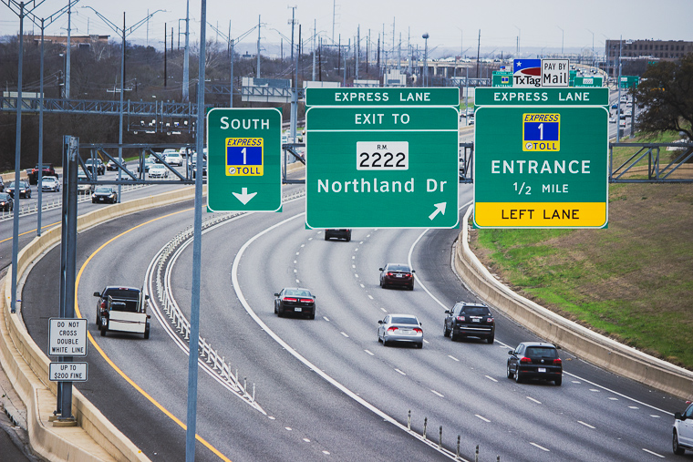

```{r echo=FALSE}
knitr::opts_chunk$set(message = FALSE)
```


In this post, I explain how I simulated vehicle records for the [Mopac Express Lane](https://www.mobilityauthority.com/traveler-info/open-roads/MoPac-Express) in Austin, Texas.



# Motivation 

I am currently working towards the release of my second R package, [sift](https://github.com/sccmckenzie/sift). This package is essentially an amalgam of various ideas I've had over the past few years. Since grouping these ideas into one package was very important to me, I needed a common theme to tie all of the functions together.

The dataset created in this post, **`express`**, serves as a realistic case study where one can effectively utilize the full capability of [sift](https://github.com/sccmckenzie/sift).

```{r setup}
library(tidyverse)
library(lubridate)
library(jsonlite)

options(readr.default_locale = locale(tz = "US/Central"))
theme_set(theme_minimal())
```

# Step 1: Reconnaissance

How frequent are various vehicle types on Mopac? Lots of F-150s? Toyota Camrys?

By no means does the intended application of the dataset require 100% accuracy. However, achieving something somewhat realistic was still important to me. After coming up dry on Google, I decided to walk out my front door and get the answer from the primary source.

Discreetly nestled in a grove overlooking Mopac, I aimed my camera at rush hour traffic and let the shutter snap for 2.5 minutes. After repeating this over the course of 1 week, I had collected over 600 frames.


These photos present a clear opportunity to apply an Image Recognition ML algorithm - but I'm saving that for a future post. 😉

The resulting dataset is named **`rush_hour`.**

```{r cache=FALSE}
rush_hour <- read_csv("https://raw.githubusercontent.com/sccmckenzie/mopac/master/inst/extdata/rush_hour.csv")
# also available in mopac::rush_hour

rush_hour %>% 
  sample_n(5) %>% 
  knitr::kable()
```

If you live in Texas, the below results shouldn't come as a surprise.

```{r eval=FALSE}
rush_hour %>% 
  unite(make_model, make, model, sep = " ") %>% 
  drop_na(make_model) %>% 
  count(make_model) %>% 
  slice_max(order_by = n, n = 10) %>% 
  ggplot(aes(n, fct_reorder(make_model, n))) +
  geom_col()
```

```{r echo=FALSE, fig.height=3}
rush_hour %>% 
  drop_na(make, model) %>% 
  unite(make_model, make, model, sep = " ") %>% 
  count(make_model) %>% 
  slice_max(order_by = n, n = 10) %>% 
  ggplot(aes(n, fct_reorder(make_model, n))) +
  geom_col() +
  scale_x_continuous(expand = c(0, 0)) +
  theme(plot.title.position = "plot",
        panel.grid.major.y = element_blank(),
        panel.grid.minor = element_blank(),
        plot.margin = margin(r = 250)) +
  labs(title = "Most frequent make/models on Mopac", x = "frequency", y = NULL)
```

Although **`rush_hour`** satisfies the need for realistic vehicle make/model frequencies, it cannot serve as a basis for inferring express lane traffic density since observations were obtained from Mopac mainlanes.

To avoid further speculation, I made another trip to acquire express lane timestamps (collected during afternoon rush hour).

```{r cache=TRUE}
express_counts <- read_csv("https://raw.githubusercontent.com/sccmckenzie/mopac/master/inst/extdata/express_counts.csv")

glimpse(express_counts)
```

# Step 2: Defining Scope

Mopac contains an express lane stretching 11 miles between downtown Austin to Parmer Lane. There is an intermediate access point near RM 2222, boxed in <span style="color: #ff00ff;">pink</span> below.

<div style = "width: 396px; margin-left: auto; margin-right: auto;">

</div>

* Our mock dataset, **`express`**, will feature vehicle descriptions + timestamps **as if they are captured at the RM 2222 checkpoint,** 
* We'll obtain peak traffic distribution by bootstrapping **`express_counts`**, then adjusting based on City of Austin data.
* Vehicle make/model/color frequencies will be inferred from **`rush_hour`**.[^1]

# Step 3: Peak Traffic Distribution

First, we extract timestamp spacing from **`express_counts`**.

```{r cache=TRUE, fig.keep='none'}
set.seed(10)
t_delta <- express_counts %>%
  mutate(t_delta = time_length(time - lag(time))) %>%
  drop_na(t_delta) %>%
  mutate(t_delta = t_delta + 2 * rbeta(n(), 2, 3)) %>%
  # ^ we add some jitter into timestamps
  # (observations were recorded with 1 sec resolution)
  pull(t_delta)

t_delta %>% 
  qplot(binwidth = 0.25) # histogram
```

```{r echo=FALSE, fig.height=3}
t_delta %>% 
  qplot(binwidth = 0.25) +
  theme(plot.title.position = "plot",
        plot.title = element_text(margin = margin(0,0,15,0))) +
  scale_y_continuous(expand = c(0, 0)) +
  labs(x = "Time length between cars [seconds]", title = "t_delta: frequency")
```

To simulate timestamps for **`express`**, we perform bootstrap sampling from the above distribution.

```{r cache=TRUE, fig.keep='none'}
# set timeframe (5am - 8pm)
t1 <- 5 
t2 <- 20
total_seconds <- (t2 - t1) * 3600

set.seed(20)
express <- tibble(direction = c("North", "South")) %>%
  rowwise(direction) %>%
  summarize(vehicle_spacing = sample(t_delta, size = total_seconds, replace = TRUE)) %>%
  # ^ generate temporal vehicle spacing
  transmute(time = make_datetime(2020, 5, 20, t1, tz = "US/Central") + cumsum(vehicle_spacing)) %>% 
    # ^ add temporal vehicle spacing together
  filter(time < make_datetime(2020, 5, 20, t2, tz = "US/Central"))
# ^ cut off timestamps later than 8pm

express %>%
  group_by(direction,
           t15 = floor_date(time, unit = "15 minutes")) %>% 
  summarize(volume = n()) %>% 
  ggplot(aes(t15, volume)) +
  geom_line(aes(color = direction))
```

```{r echo=FALSE, fig.height=3}
express %>%
  group_by(direction,
           t15 = floor_date(time, unit = "15 minutes")) %>% 
  summarize(volume = n()) %>% 
  ggplot(aes(t15, volume)) +
  geom_line(aes(color = direction), size = 1.5) +
  scale_y_continuous(limits = c(0, 200)) +
  labs(title = "Simulated Traffic Volume at Mopac Express Lane (Far West)",
       subtitle = "Summed over 15 min intervals",
       x = NULL, y = NULL)
```

While we have achieved some randomness, the consistent baseline around 150 is unrealistic. For example, around 6:00am, nobody is *actually* using the express lane.

# Step 4: Exploring City of Austin API

Although Texas state highway traffic count data is elusive (at least at the granularity needed for this application), the City of Austin (COA) provides ample resources on frontage road intersections.

Below we access Mopac & Steck Ave traffic volume measurements from COA open data portal. This intersection is located ~ 3mi north of Mopac & RM 2222, which unfortunately doesn't have records in the [Camera Traffic Counts](https://data.austintexas.gov/Transportation-and-Mobility/Camera-Traffic-Counts/sh59-i6y9) table.

```{r cache=TRUE}
steck <- jsonlite::fromJSON('https://data.austintexas.gov/resource/sh59-i6y9.json?atd_device_id=6409&year=2020&month=5&day=20&heavy_vehicle=false') %>% 
  as_tibble() %>% 
  janitor::clean_names() %>% 
  transmute(read_date = as_datetime(read_date, tz = "US/Central"),
            direction,
            movement,
            volume = as.integer(volume))
```

Each row contains measurements summarized over 15 minutes intervals.
```{r}
steck %>% 
  sample_n(5) %>% 
  knitr::kable()
```
Here, we restrict our focus to north & south, as these are the only directions that could correspond to cars entering Mopac.

```{r eval=FALSE}
steck %>% 
  filter(direction %in% c("NORTHBOUND", "SOUTHBOUND")) %>%
  group_by(direction, read_date) %>% 
  summarize(volume = sum(volume)) %>% 
  ggplot(aes(read_date, volume)) +
  geom_line(aes(color = direction))
```

```{r, echo=FALSE, fig.height=3}
steck %>% 
  filter(direction %in% c("NORTHBOUND", "SOUTHBOUND")) %>%
  group_by(direction, read_date) %>% 
  summarize(volume = sum(volume)) %>% 
  ggplot(aes(read_date, volume)) +
  geom_line(aes(color = direction), size = 1.5) +
  scale_x_datetime(date_breaks = "3 hours", date_labels = "%R") +
  theme(plot.title.position = "plot") +
  scale_x_datetime(date_breaks = "3 hours", date_labels = "%R") +
  labs(title = "Traffic Volume at Mopac & Steck Ave",
       subtitle = "Summed over 15 min intervals",
       caption = "Data: City of Austin",
       x = NULL, y = NULL)
```

The above distribution is much more believable: starting around 6am, traffic increases, levels out, gets worse around lunch, and finally recedes after 6pm.

The large discrepancy between north & south may be due to the fact that it's extremely difficult to get on northbound Mopac from Steck Ave. In other words, people may be opting for an alternate access point if they are travelling north.

For the sake of simplicity, we will project the SOUTHBOUND distribution onto our **`express`** dataset (both directions).

```{r, cache=TRUE, fig.keep='none'}
steck_normalized <- steck %>% 
  filter(direction == "SOUTHBOUND") %>% 
  with_groups(read_date,
              summarize,
              volume = sum(volume)) %>% 
  transmute(id = row_number(),
            read_date,
            volume = volume/max(volume))

set.seed(25)

# join Steck volume with express timestamps
express <- express %>% 
  mutate(id = findInterval(time, steck_normalized$read_date)) %>% 
  left_join(steck_normalized, by = "id") %>% 
  rowwise() %>% 
  mutate(keep = sample(c(FALSE, TRUE), prob = c(1 - volume, volume), size = 1)) %>% 
  # ^ treat volume as probability of keeping row in express
  ungroup() %>% 
  filter(keep) %>% 
  select(direction, time) %>% 
  arrange_all()

express %>%
  group_by(direction,
           t15 = floor_date(time, unit = "15 minutes")) %>% 
  summarize(volume = n()) %>% 
  ggplot(aes(t15, volume)) +
  geom_line(aes(color = direction))
```

```{r echo=FALSE, fig.height=3}
express %>%
  group_by(direction,
           t15 = floor_date(time, unit = "15 minutes")) %>% 
  summarize(volume = n()) %>% 
  ggplot(aes(t15, volume)) +
  geom_line(aes(color = direction), size = 1.5) +
  scale_y_continuous(limits = c(0, 200)) +
  labs(title = "Simulated Traffic Volume at Mopac Express Lane (Far West)",
       subtitle = "Summed over 15 min intervals",
       x = NULL, y = NULL)
```

Voila! Admittedly, this is a somewhat hackish method to achieve the desired result. For the intended purpose of this dataset, we don't need to worry about using more sophisticated statistical techniques.

# Step 5: Trip Modeling

Though we could arbitrarily assign a unique vehicle for each row in **`express`**, this wouldn't be realistic. Consider the below scenarios: 

1. Vehicle uses Express Lane once **in one direction**.
2. Vehicle uses Express Lane once **in both directions** (e.g. commuting to & from work).
3. Vehicle uses Express Lane thrice **in any combination of directions** (e.g. rideshare).

Before we jump in, let's create a helper to extract hour of day as a decimal. This will improve readability of our downstream code.

```{r}
hourday <- function(t) {
  time_length(t - make_datetime(2020, 5, 20, tz = "US/Central"), unit = "hours")
}

# example
hourday(as_datetime("2020-05-20 12:30:00", tz = "US/Central"))
```

For Scenario #1, each vehicle corresponds to one timestamp. We'll obtain 5000 observations using a single unbiased sample. 

```{r cache=TRUE, fig.keep='none'}
set.seed(254)
scenario_1 <- express %>% 
  sample_n(size = 5000) %>% 
  mutate(v_id = row_number())

scenario_1 %>% 
  ggplot(aes(time)) + 
  geom_histogram(aes(fill = direction), binwidth = 900)
```

```{r echo = FALSE, fig.height=3}
scenario_1 %>% 
  ggplot(aes(time)) + 
  geom_histogram(aes(fill = direction), binwidth = 900) +
  theme(panel.grid.minor = element_blank(),
        panel.grid.major.x = element_blank()) +
  labs(title = "Scenario 1", subtitle = "Timestamp Distribution", x = NULL) +
  scale_y_continuous(expand = c(0 ,0))
```

Note the above distribution contains roughly the same amount of north & south observations. For Scenario 2, we'll need to enforce actual equality between directions so that each north timestamps has a corresponding south timestamp.

Each vehicle will contain 2 timestamps:

* Timestamp A (driving to work)
* Timestamp B (driving home)

We sample **A** Timestamps weighted by $\mathcal{N}(7\textrm{am}, 4\textrm{hr})$.

```{r, cache=TRUE}
set.seed(400)
scenario_2A <- express %>% 
  anti_join(scenario_1) %>%
  # ^ exclude observations already sampled into scenario_1
  group_by(direction) %>% 
  # ^ need equal amounts of north & south samples
  sample_n(size = 1000, weight = dnorm(hourday(time), mean = 7, sd = 2)) %>% 
  mutate(id = row_number()) %>% 
  ungroup()
```

We'll assume most trips take ~10 hours (9 hour workday + 30 minute commute each way). This implies a **B** timestamp distribution of $\mathcal{N}(5\textrm{pm}, 4\textrm{hr})$.

```{r cache=TRUE, fig.keep='none'}
scenario_2B <- express %>% 
  anti_join(scenario_1) %>%
  anti_join(scenario_2A) %>% 
  group_by(direction) %>% 
  sample_n(size = 1000, weight = dnorm(hourday(time), mean = 17, sd = 2)) %>% 
  mutate(id = row_number()) %>% 
  ungroup()

bind_rows(
  mutate(scenario_2A, grp = "A"), 
  mutate(scenario_2B, grp = "B")
  ) %>% 
  ggplot(aes(time)) +
  geom_histogram(aes(fill = grp))
```

```{r echo=FALSE, fig.height=3}
bind_rows(
  mutate(scenario_2A, grp = "A"), 
  mutate(scenario_2B, grp = "B")
  ) %>% 
  ggplot(aes(time)) +
  geom_histogram(aes(fill = grp)) +
  theme(panel.grid.minor = element_blank(),
        panel.grid.major.x = element_blank()) +
  scale_fill_manual(values = c("#F7AA00", "#235784"), name = NULL) +
  labs(title = "Scenario 2", subtitle = "Timestamp Distribution", x = NULL) +
  scale_y_continuous(expand = c(0 ,0))
```

Notice there is some overlap between the A & B distribution. This is intentional, as there will inevitably be some drivers that start their commute in the afternoon.

Currently, there are no unique vehicles tying observations together between **`scenario_2A`** & **`scenario_2B`**. At first, I tried using for-loop structure - but this was excessively slow. After some brainstorming, I came up with the below procedure, which avoids for-loops entirely!

1. Randomly create multiple sets of timestamp pairs (only pairing opposite directions together).
2. Eliminate sets that contain impossible pairs (e.g. negative trip length).
3. Examine trip length distributions and select set that appears normal.

```{r cache=TRUE, fig.keep='none'}
# I arbitrarily set the number of repetitions to 100,
# which is ultimately more than enough to achieve desired result
scenario_2_sim <- bind_rows(
  map_dfr(1:100, ~ {
  tibble(i = ..1,
         direction = "NS",
         North = filter(scenario_2A, direction == "North")$time %>% sample(),
         South = filter(scenario_2B, direction == "South")$time %>% sample())
    # ^ for a given set, each timestamp only appears once
  }),
  map_dfr(1:100, ~ {
  tibble(i = ..1,
         direction = "SN",
         South = filter(scenario_2A, direction == "South")$time %>% sample(),
         North = filter(scenario_2B, direction == "North")$time %>% sample())
    # ^ same thing as above, except now we flip the directions
  })
) %>% 
  mutate(l = if_else(direction == "NS",
                     time_length(South - North, unit = "hours"),
                     time_length(North - South, unit = "hours"))) %>% 
  with_groups(c(direction, i), filter, !any(l < 0.5))
# ^ a complete circuit around the express lane would take at least 1/2 an hour
  
scenario_2_sim %>% 
  ggplot(aes(l)) +
  geom_density(aes(color = factor(i))) +
  facet_wrap(~ direction, ncol = 1)
```

```{r echo=FALSE}
scenario_2_sim %>% 
  ggplot(aes(l)) +
  geom_density(aes(color = factor(i))) +
  facet_wrap(~ direction, ncol = 1) +
  theme(panel.grid.minor = element_blank(),
        panel.grid.major.x = element_blank(),
        legend.position = "none") +
  labs(title = "Scenario 2 - Trip Length Distribution", subtitle = "Colors represent distinct simulations", x = NULL) +
  scale_y_continuous(expand = c(0 ,0))
```

Most of these distributions appear normal. We'll pick the one with the highest Shapiro-Wilk normality test statistic.

```{r cache=TRUE}
library(broom)

scenario_2 <- scenario_2_sim %>% 
  group_by(direction, i) %>% 
  summarize(vec = list(l)) %>% 
  rowwise() %>% 
  mutate(shapiro.test(vec) %>% tidy()) %>% 
  filter(p.value < 0.1) %>% 
  group_by(direction) %>% 
  slice_max(order_by = statistic) %>% 
  semi_join(scenario_2_sim, .) %>% 
  transmute(North, South, v_id = max(scenario_1$v_id) + row_number()) %>% 
  pivot_longer(North:South, names_to = "direction", values_to = "time")
```

For Scenario 3, we won't impose any distributional or directional constraints on timestamp selection.

```{r cache=TRUE}
scenario_3 <- express %>% 
  anti_join(scenario_1) %>% 
  anti_join(scenario_2) %>% 
  sample_n(size = n()) %>% 
  mutate(v_id = (row_number() - 1) %% 3 == 0,
         v_id = cumsum(v_id) + max(scenario_2$v_id)) %>% 
  group_by(v_id) %>% 
  arrange(v_id, time) %>% 
  mutate(delta = time_length(time - lag(time), unit = "hours")) %>% 
  filter(!any(delta < 1, na.rm = TRUE)) %>% 
  ungroup() %>% 
  slice_head(n = 300) %>% 
  select(direction, time, v_id)
```

<!-- ```{r} -->
<!-- express %>% -->
<!--   anti_join(scenario_1) %>% -->
<!--   anti_join(scenario_2) %>% -->
<!--   anti_join(scenario_3) %>% -->
<!--   ggplot(aes(time)) + -->
<!--   geom_histogram(aes(fill = direction)) -->
<!-- ``` -->

<!-- ```{r} -->
<!-- express %>% -->
<!--   anti_join(scenario_1) %>% -->
<!--   anti_join(scenario_2) %>% -->
<!--   anti_join(scenario_3) -->
<!-- ``` -->

