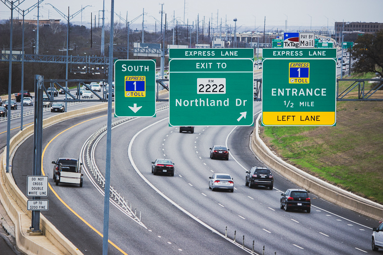
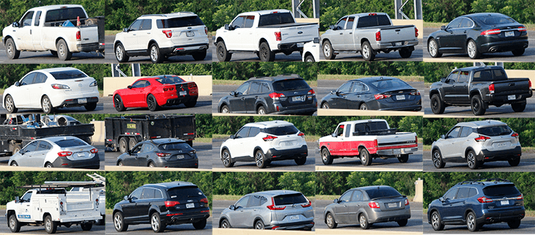
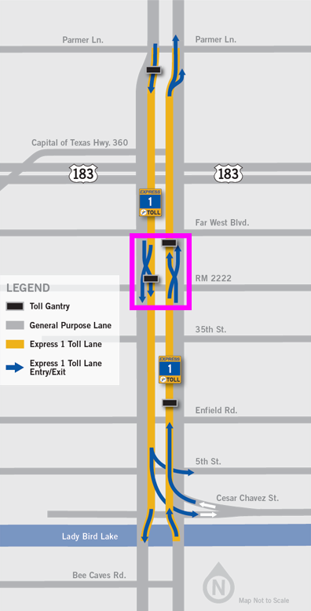

```{r echo=FALSE}
knitr::opts_chunk$set(message = FALSE, warning = FALSE, dev = "svglite")
```


In this post, I explain how I simulated vehicle records for the [Mopac Express Lane](https://www.mobilityauthority.com/traveler-info/open-roads/MoPac-Express) in Austin, Texas.



# Motivation 

I am currently working towards the release of my second R package, [sift](https://github.com/sccmckenzie/sift). This package is essentially an amalgam of various ideas I've had over the past few years. Since grouping these ideas into one package was very important to me, I needed a common theme to tie all of the functions together.

The dataset created in this post, **`express`**, serves as a realistic case study where one can effectively utilize the full capability of [sift](https://github.com/sccmckenzie/sift).

```{r setup}
library(tidyverse)
library(lubridate)
library(jsonlite)

options(readr.default_locale = locale(tz = "US/Central"))
theme_set(theme_minimal())
```

# Step 1: Reconnaissance

How frequent are various vehicle types on Mopac? Lots of F-150s? Toyota Camrys?

By no means does the intended application of the dataset require 100% accuracy. However, achieving something somewhat realistic was still important to me. After coming up dry on Google, I decided to walk out my front door and get the answer from the primary source.

Discreetly nestled in a grove overlooking Mopac, I aimed my camera at rush hour traffic and let the shutter snap for 2.5 minutes. After repeating this over the course of 1 week, I had collected over 600 frames.



These photos present a clear opportunity to apply an Image Recognition ML algorithm - but I'm saving that for a future post. 😉

The resulting dataset is named **`rush_hour`.**

```{r cache=FALSE}
rush_hour <- read_csv("https://raw.githubusercontent.com/sccmckenzie/mopac/master/inst/extdata/rush_hour.csv")
# also available in mopac::rush_hour

rush_hour %>% 
  sample_n(5) %>% 
  knitr::kable()
```

If you live in Texas, the below results shouldn't come as a surprise.

```{r eval=FALSE}
rush_hour %>% 
  unite(make_model, make, model, sep = " ") %>% 
  drop_na(make_model) %>% 
  count(make_model) %>% 
  slice_max(order_by = n, n = 10) %>% 
  ggplot(aes(n, fct_reorder(make_model, n))) +
  geom_col()
```

```{r echo=FALSE, fig.height=3}
rush_hour %>% 
  drop_na(make, model) %>% 
  unite(make_model, make, model, sep = " ") %>% 
  count(make_model) %>% 
  slice_max(order_by = n, n = 10) %>% 
  ggplot(aes(n, fct_reorder(make_model, n))) +
  geom_col() +
  scale_x_continuous(expand = c(0, 0)) +
  theme(plot.title.position = "plot",
        panel.grid.major.y = element_blank(),
        panel.grid.minor = element_blank()) +
  labs(title = "Most frequent make/models on Mopac", x = "frequency", y = NULL)
```

Although **`rush_hour`** satisfies the need for realistic vehicle make/model frequencies, it cannot serve as a basis for inferring express lane traffic density since observations were obtained from Mopac mainlanes.

To avoid further speculation, I made another trip to acquire express lane timestamps (collected during afternoon rush hour).

```{r cache=TRUE}
express_counts <- read_csv("https://raw.githubusercontent.com/sccmckenzie/mopac/master/inst/extdata/express_counts.csv")

glimpse(express_counts)
```

# Step 2: Defining Scope

Mopac contains an express lane stretching 11 miles between downtown Austin to Parmer Lane. There is an intermediate access point near RM 2222, boxed in <span style="color: #ff00ff;">pink</span> below.

<div style = "width: 396px; margin-left: auto; margin-right: auto;">

</div>

* Our mock dataset, **`express`**, will feature vehicle descriptions + timestamps **as if they are captured at the RM 2222 checkpoint,** 
* We'll obtain peak traffic distribution by bootstrapping **`express_counts`**, then adjusting based on City of Austin data.
* Vehicle make/model/color frequencies will be inferred from **`rush_hour`**.[^1]

# Step 3: Traffic Distribution

First, we extract timestamp spacing from **`express_counts`**.

```{r cache=TRUE, fig.keep='none'}
set.seed(10)
t_delta <- express_counts %>%
  mutate(t_delta = time_length(time - lag(time))) %>%
  drop_na(t_delta) %>%
  mutate(t_delta = t_delta + 2 * rbeta(n(), 2, 3)) %>%
  # ^ we add some jitter into timestamps
  # (observations were recorded with 1 sec resolution)
  pull(t_delta)

t_delta %>% 
  qplot(binwidth = 0.25) # histogram
```

```{r echo=FALSE, fig.height=3}
t_delta %>% 
  qplot(binwidth = 0.25) +
  theme(plot.title.position = "plot",
        plot.title = element_text(margin = margin(0,0,15,0))) +
  scale_y_continuous(expand = c(0, 0)) +
  labs(x = "Time length between cars [seconds]", title = "t_delta: frequency")
```

To simulate timestamps for **`express`**, we perform bootstrap sampling from the above distribution.

```{r cache=TRUE, fig.keep='none'}
# set timeframe (5am - 8pm)
t1 <- 5 
t2 <- 20
total_seconds <- (t2 - t1) * 3600

set.seed(20)
express <- tibble(direction = c("North", "South")) %>%
  rowwise(direction) %>%
  summarize(vehicle_spacing = sample(t_delta, size = total_seconds, replace = TRUE)) %>%
  # ^ generate temporal vehicle spacing
  transmute(time = make_datetime(2020, 5, 20, t1, tz = "US/Central") + cumsum(vehicle_spacing)) %>% 
    # ^ add temporal vehicle spacing together
  filter(time < make_datetime(2020, 5, 20, t2, tz = "US/Central"))
# ^ cut off timestamps later than 8pm

express %>%
  group_by(direction,
           t15 = floor_date(time, unit = "15 minutes")) %>% 
  summarize(volume = n()) %>% 
  ggplot(aes(t15, volume)) +
  geom_line(aes(color = direction))
```

```{r echo=FALSE, fig.height=3}
express %>%
  group_by(direction,
           t15 = floor_date(time, unit = "15 minutes")) %>% 
  summarize(volume = n()) %>% 
  ggplot(aes(t15, volume)) +
  geom_line(aes(color = direction), size = 1.5) +
  scale_y_continuous(limits = c(0, 200)) +
  labs(title = "Simulated Traffic Volume at Mopac Express Lane (Far West)",
       subtitle = "Summed over 15 min intervals",
       x = NULL, y = NULL)
```

While we have achieved some randomness, the consistent baseline around 150 is unrealistic. For example, around 6:00am, nobody is *actually* using the express lane.

Luckily, I managed to find a table containing real traffic counts from the City of Austin Open Data Portal. The low-level details here aren't super exciting - I've only included the code for the sake of reproducibility. Essentially, I am projecting the real traffic density profile onto the above baseline distribution.

```{r cache=TRUE, fig.keep='none'}
steck <- jsonlite::fromJSON('https://data.austintexas.gov/resource/sh59-i6y9.json?atd_device_id=6409&year=2020&month=5&day=20&heavy_vehicle=false') %>% 
  as_tibble() %>% 
  janitor::clean_names() %>% 
  filter(direction == "SOUTHBOUND") %>% 
  transmute(read_date = as_datetime(read_date, tz = "US/Central"),
            direction,
            movement,
            volume = as.integer(volume)) %>% 
  with_groups(read_date,
              summarize,
              volume = sum(volume)) %>% 
  transmute(id = row_number(),
            read_date,
            volume = volume/max(volume))

# join Steck volume with express timestamps
set.seed(25)
express <- express %>% 
  mutate(id = findInterval(time, steck$read_date)) %>% 
  left_join(steck, by = "id") %>% 
  rowwise() %>% 
  mutate(keep = sample(c(FALSE, TRUE), prob = c(1 - volume, volume), size = 1)) %>% 
  # ^ treat volume as probability of keeping row in express
  ungroup() %>% 
  filter(keep) %>% 
  select(direction, time) %>% 
  arrange_all()

express %>%
  group_by(direction,
           t15 = floor_date(time, unit = "15 minutes")) %>% 
  summarize(volume = n()) %>% 
  ggplot(aes(t15, volume)) +
  geom_line(aes(color = direction))
```

```{r echo=FALSE, fig.height=3}
express %>%
  group_by(direction,
           t15 = floor_date(time, unit = "15 minutes")) %>% 
  summarize(volume = n()) %>% 
  ggplot(aes(t15, volume)) +
  geom_line(aes(color = direction), size = 1.5) +
  scale_y_continuous(limits = c(0, 200)) +
  labs(title = "Simulated Traffic Volume at Mopac Express Lane (Far West)",
       subtitle = "Summed over 15 min intervals",
       x = NULL, y = NULL)
```

Voila! The above distribution is much more believable: starting around 6am, traffic increases, levels out, and finally recedes around 6pm.

# Step 4: Trip Modeling

We've arrived at the main course.

Though we could arbitrarily assign a unique vehicle for each row in **`express`**, this wouldn't be realistic. Consider the below scenarios: 

1. Vehicle uses Express Lane once **in one direction**.
2. Vehicle uses Express Lane once **in both directions** (e.g. commuting to & from work).
3. Vehicle uses Express Lane thrice **in any combination of directions** (e.g. rideshare).

Before we jump in, let's create a helper to extract hour of day as a decimal. This will improve readability of our downstream code.

```{r}
hourday <- function(t) {
  time_length(t - make_datetime(2020, 5, 20, tz = "US/Central"), unit = "hours")
}

# example
hourday(as_datetime("2020-05-20 12:30:00", tz = "US/Central"))
```

For **Scenario #1**, each vehicle corresponds to one timestamp. We'll obtain 5000 observations using a single unbiased sample. 

```{r cache=TRUE, fig.keep='none'}
set.seed(254)
scenario_1 <- express %>% 
  sample_n(size = 5000) %>% 
  mutate(v_id = row_number())

scenario_1 %>% 
  ggplot(aes(time)) + 
  geom_histogram(aes(fill = direction), binwidth = 900)
```

```{r echo = FALSE, fig.height=3}
scenario_1 %>% 
  ggplot(aes(time)) + 
  geom_histogram(aes(fill = direction), binwidth = 900) +
  theme(panel.grid.minor = element_blank(),
        panel.grid.major.x = element_blank()) +
  labs(title = "Scenario 1", subtitle = "Timestamp Distribution", x = NULL) +
  scale_y_continuous(expand = c(0 ,0))
```

Note the above distribution contains roughly the same amount of north & south observations.

For **Scenario 2**, we'll need to enforce actual equality between directions so that each north timestamp has a corresponding south timestamp.

Each vehicle will contain 2 timestamps:

* Timestamp A (driving to work)
* Timestamp B (driving home)

We sample **A** Timestamps weighted by $\mathcal{N}(7\textrm{am}, 4\textrm{hr})$.

```{r, cache=TRUE}
set.seed(400)
scenario_2A <- express %>% 
  anti_join(scenario_1) %>%
  # ^ exclude observations already sampled into scenario_1
  group_by(direction) %>% 
  # ^ need equal amounts of north & south samples
  sample_n(size = 1000, weight = dnorm(hourday(time), mean = 7, sd = 2)) %>% 
  mutate(id = row_number()) %>% 
  ungroup()
```

We'll assume most trips take ~10 hours (9 hour workday + 30 minute commute each way). This implies a **B** timestamp distribution of $\mathcal{N}(5\textrm{pm}, 4\textrm{hr})$.

```{r cache=TRUE, fig.keep='none'}
scenario_2B <- express %>% 
  anti_join(scenario_1) %>%
  anti_join(scenario_2A) %>% 
  group_by(direction) %>% 
  sample_n(size = 1000, weight = dnorm(hourday(time), mean = 17, sd = 2)) %>% 
  mutate(id = row_number()) %>% 
  ungroup()

bind_rows(
  mutate(scenario_2A, grp = "A"), 
  mutate(scenario_2B, grp = "B")
  ) %>% 
  ggplot(aes(time)) +
  geom_histogram(aes(fill = grp))
```

```{r echo=FALSE, fig.height=3}
bind_rows(
  mutate(scenario_2A, grp = "A"), 
  mutate(scenario_2B, grp = "B")
  ) %>% 
  ggplot(aes(time)) +
  geom_histogram(aes(fill = grp)) +
  theme(panel.grid.minor = element_blank(),
        panel.grid.major.x = element_blank()) +
  scale_fill_manual(values = c("#F7AA00", "#235784"), name = NULL) +
  labs(title = "Scenario 2", subtitle = "Timestamp Distribution", x = NULL) +
  scale_y_continuous(expand = c(0 ,0))
```

Notice there is some overlap between the A & B distribution. This is intentional, as there will inevitably be some drivers that start their commute in the afternoon.

Currently, there are no unique vehicles tying observations together between **`scenario_2A`** & **`scenario_2B`**. Timestamp pairing is deceptively challenging if we wish to avoid inefficient for-loop structures. After some trial-and-error, I found the below procedure to work quite nicely:

1. Randomly generate multiple sets - each containing 2500 pairs of observations (only pairing opposite directions together).

```{r eval = FALSE}
# Example of one 'set' for North -> South
# Within one set, each observation occurs once
# North[i] is 'paired' with South[i]
set.seed(451)
North <- sample(filter(scenario_2A, direction == "North")$time)
South <- sample(filter(scenario_2B, direction == "South")$time)
```

2. Eliminate sets that contain impossible pairs (e.g. negative trip length).
3. Examine trip length distributions and select set that appears normal.

The full implementation of this procedure is shown below.

```{r cache=TRUE, fig.keep='none'}
set.seed(90)

# I arbitrarily set the number of repetitions to 100,
# which is ultimately more than enough to achieve desired result
scenario_2_sim <- bind_rows(
  map_dfr(1:100, ~ {
  tibble(i = ..1,
         direction = "NS",
         North = filter(scenario_2A, direction == "North")$time %>% sample(),
         South = filter(scenario_2B, direction == "South")$time %>% sample())
  }),
  # now we flip the directions
  map_dfr(1:100, ~ {
  tibble(i = ..1,
         direction = "SN",
         South = filter(scenario_2A, direction == "South")$time %>% sample(),
         North = filter(scenario_2B, direction == "North")$time %>% sample())
  })
) %>% 
  mutate(l = if_else(direction == "NS",
                     time_length(South - North, unit = "hours"),
                     time_length(North - South, unit = "hours"))) %>% 
  with_groups(c(direction, i), filter, !any(l < 0.5))

  
scenario_2_sim %>% 
  ggplot(aes(l)) +
  geom_density(aes(color = factor(i))) +
  facet_wrap(~ direction, ncol = 1)
```

```{r echo=FALSE}
scenario_2_sim %>% 
  ggplot(aes(l)) +
  geom_density(aes(color = factor(i))) +
  facet_wrap(~ direction, ncol = 1) +
  theme(panel.grid.minor = element_blank(),
        panel.grid.major.x = element_blank(),
        legend.position = "none") +
  labs(title = "Scenario 2 - Trip Length Distribution", subtitle = "Colors represent distinct simulations", x = NULL) +
  scale_y_continuous(expand = c(0 ,0))
```

Most of these distributions appear normal. We'll pick the one with the highest Shapiro-Wilk normality test statistic.

```{r cache=TRUE}
library(broom)

scenario_2 <- scenario_2_sim %>% 
  group_by(direction, i) %>% 
  summarize(vec = list(l)) %>% 
  rowwise() %>% 
  mutate(shapiro.test(vec) %>% tidy()) %>% 
  filter(p.value < 0.1) %>% 
  group_by(direction) %>% 
  slice_max(order_by = statistic) %>% 
  semi_join(scenario_2_sim, .) %>% 
  transmute(North, South, v_id = max(scenario_1$v_id) + row_number()) %>% 
  pivot_longer(North:South, names_to = "direction", values_to = "time")
```

For **Scenario 3**, we won't impose any distributional or directional constraints on timestamp selection, simplifying the procedure considerably.

Since the average driver is unlikely to use the express lane more than twice / day, we will assign 100 vehicles to Scenario 3.

First, we shuffle the remaining rows in **`express`** and assign 3 timestamps per vehicle.

```{r cache=TRUE}
set.seed(100)

scenario_3 <- express %>% 
  anti_join(scenario_1) %>% 
  anti_join(scenario_2) %>% 
  sample_n(size = n()) %>% 
  mutate(v_id = (row_number() - 1) %% 3 == 0,
         v_id = cumsum(v_id) + max(scenario_2$v_id)) %>% 
  arrange(v_id, time)

scenario_3 %>% 
  slice_head(n = 9) %>% 
  knitr::kable()
```

All that remains is to exclude vehicles with unrealistic timestamps. This time, we'll use a lower threshold of 1 hour.

```{r}
scenario_3 <- scenario_3 %>%   
  group_by(v_id) %>% 
  mutate(delta = time_length(time - lag(time), unit = "hours")) %>% 
  filter(!any(delta < 1, na.rm = TRUE)) %>% 
  ungroup() %>% 
  slice_head(n = 300) %>% 
  # ^ 3 rows / vehicle * 100 vehicles = 300 rows
  select(direction, time, v_id)
```

There is also an Easter Egg I wish to plant: 2 vehicles that travel close together twice in one day. This is part of a fictional "bank robbery."

We'll sample a pair of timestamps each from noon and 5:00pm (assuming the robbery takes place within that timeframe).

```{r}
set.seed(99)

robbery_A <- express %>% 
  anti_join(scenario_1) %>% 
  anti_join(scenario_2) %>% 
  anti_join(scenario_3) %>% 
  sample_n(size = 2, weight = dnorm(hourday(time), mean = 12, sd = 0.1)) %>% 
  mutate(v_id = max(scenario_2$v_id) + row_number())

robbery_B <- express %>% 
  anti_join(scenario_1) %>% 
  anti_join(scenario_2) %>% 
  anti_join(scenario_3) %>% 
  sample_n(size = 2, weight = dnorm(hourday(time), mean = 17, sd = 0.1)) %>% 
  mutate(v_id = max(scenario_2$v_id) + row_number())

robbery <- bind_rows(robbery_A, robbery_B)
```

Finally, we'll assign the remaining timestamps to Scenario 1.

```{r}
express <- express %>%
  anti_join(scenario_1) %>% 
  anti_join(scenario_2) %>% 
  anti_join(scenario_3) %>% 
  anti_join(robbery) %>% 
  mutate(v_id = max(robbery$v_id) + row_number()) %>% 
  bind_rows(scenario_1, scenario_2, scenario_3, robbery) %>% 
  arrange(direction, time)
```

# Step 5: Make/model assignment

We've successfully assigned a **`v_id`** to each timestamp - but **`v_id`** is only an integer. Now, we need to assign vehicle make/model/color to each **`v_id`**.

It's finally time to leverage **`rush_hour``** from Step 1.

For simplicity, we'll assume the true frqeuency for each make/model does not depend upon day of the week. Hence, we treat each day as an independent sample. The below code calculates the weight of each make/model within each sample, then averages the weights between samples.

```{r}
vehicle_probs <- rush_hour %>% 
  drop_na() %>% 
  count(day, make, model) %>% 
  group_by(day) %>% 
  mutate(wt = n / sum(n)) %>% 
  group_by(make, model) %>% 
  summarize(wt_mean = mean(wt), .groups = "drop") %>% 
  mutate(wt = wt_mean / sum(wt_mean), .keep = "unused")
```

For colors, we'll sum across the entire dataset.

```{r}
color_probs <- rush_hour %>%
  drop_na() %>%
  count(make, model, color) %>%
  group_by(make, model) %>%
  mutate(wt = n / sum(n)) %>%
  ungroup()
```

We use **`sample_n`** to assign make/model/color in a vectorized fashion. Here, **`dplyr`** allows us to seamlessly change grouping as we progress through the operation.

```{r}
set.seed(98)
express <- express %>% 
  distinct(v_id) %>% 
  # make/model
  bind_cols(sample_n(vehicle_probs,
                     size = nrow(.),
                     weight = wt,
                     replace = TRUE)) %>% 
  select(!wt) %>% 
  # color
  full_join(color_probs) %>% 
  group_by(v_id) %>% 
  sample_n(size = 1, weight = wt) %>% 
  select(!(n:wt)) %>% 
  inner_join(express, .) # join it all back with express

express %>% 
  sample_n(5) %>% 
  knitr::kable()
```
 
# Step 6: Plate Assignment

Investigating license plate statistics (e.g. from where are the most frequent out-of-state plates) is certainly worth investigating - but for now, I'm choosing to generate plates that solely adhere to Texas formatting: 3 characters + 4 numbers. Again, the tidyverse saves us from expensive for-loop operations.

```{r}
set.seed(97)
plate_letters <- crossing(L1 = LETTERS, L2 = LETTERS, L3 = LETTERS) %>%
  mutate(st = str_c(L1, L2, L3, sep = "")) %>%
  pull(st) %>%
  sample(., n_distinct(express$v_id), replace = TRUE)

plate_numbers <- 0:9999
plate_numbers <- str_pad(plate_numbers, side = "left", pad = "0", width = 4) %>%
  sample(., n_distinct(express$v_id), replace = TRUE)

plates <- str_c(plate_letters, plate_numbers, sep = "-")
```

At last, **`plate`** replaces the role of **`v_id`**.

```{r}
express <- express %>% 
  distinct(v_id) %>% 
  mutate(plate = plates) %>% 
  inner_join(express, .) %>% 
  relocate(plate, .before = make) %>% 
  select(!v_id)

express %>% 
  sample_n(5) %>% 
  knitr::kable()
```

[^1]: Although public service vehicles like metro buses utilize the Express Lane, we will exclude them here.